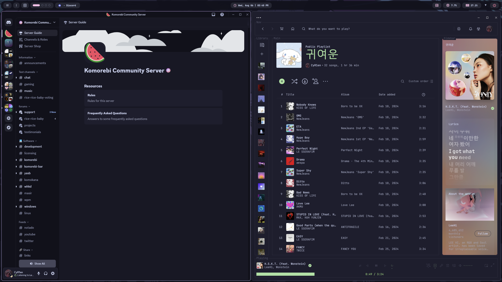

<h3 align="center">
	 
	
	
</h3>

  

  This repository contains dotfiles (configuration) for my Windows desktop.

    
    
    
    

  

### Software
- [Komorebi](https://github.com/LGUG2Z/komorebi)
- [YASB Reborn](https://github.com/amnweb/yasb)
- [Tacky-Borders](https://github.com/lukeyou05/tacky-borders)
- [FastFetch](https://github.com/fastfetch-cli/fastfetch)
- [alacritty](https://github.com/alacritty/alacritty)

### Requirements
- [JetBrainsMono Nerd Font](https://www.nerdfonts.com/font-downloads)
- Set screens for YASB
- Set your paths
